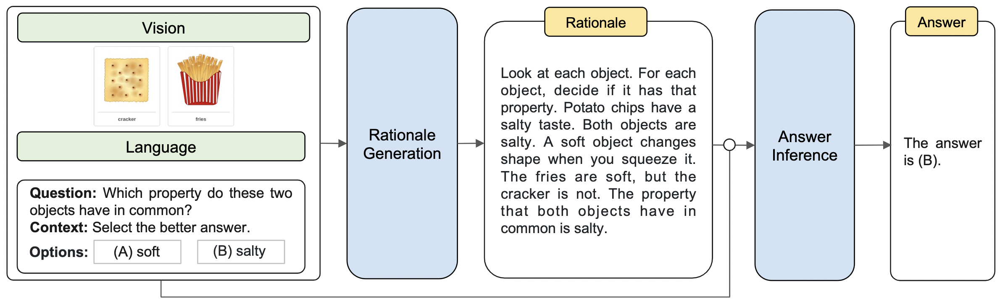

# Multimodal Chain-of-Thought Reasoning in Language Models

<h5 align="center"><i>"Imagine learning a textbook without figures or tables."</i></h5>

Multimodal-CoT incorporates vision features in a decoupled training framework. The framework consists of two training stages: (i) rationale generation and (ii) answer inference. Both stages share the same model architecture but differ in the input and output.




## Requirements

Install all required python dependencies:

```
pip install -r requirements.txt
```

## Datasets

Download the dataset from the following repository:

```
https://github.com/lupantech/ScienceQA/tree/main/data
```

## Instructions

### Training 

```
# rationale generation
CUDA_VISIBLE_DEVICES=0,1 python main.py \
    --model allenai/unifiedqa-t5-base \
    --user_msg rationale --img_type detr \
    --bs 8 --eval_bs 4 --eval_acc 10 --output_len 512 \
    --final_eval --prompt_format QCM-LE

# answer inference
CUDA_VISIBLE_DEVICES=0,1 python main.py \
    --model allenai/unifiedqa-t5-base \
    --user_msg answer --img_type detr \
    --bs 8 --eval_bs 4 --eval_acc 10 --output_len 64 \
    --final_eval --prompt_format QCMG-A \
    --eval_le experiments/rationale_allenai-unifiedqa-t5-base_detr_QCM-LE_lr5e-05_bs16_op512_ep20/predictions_ans_eval.json \
    --test_le experiments/rationale_allenai-unifiedqa-t5-base_detr_QCM-LE_lr5e-05_bs16_op512_ep20/predictions_ans_test.json
```
